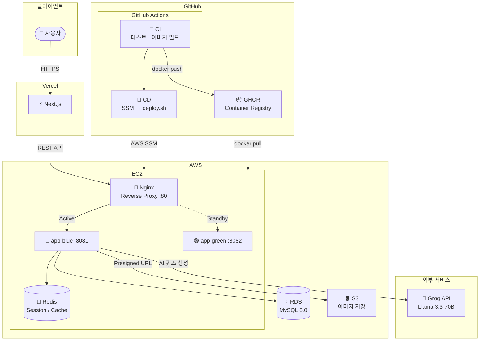

# Study Backend

온라인 교육 플랫폼을 위한 Spring Boot REST API 백엔드입니다.
학습 콘텐츠 관리, AI 기반 퀴즈 생성, 실시간 알림, 회원 관리 등의 기능을 제공합니다.

---

## 기술 스택

| 분류 | 기술 |
|------|------|
| **Framework** | Spring Boot 4.0.3, Java 21 |
| **Database** | MySQL 8.0, Redis |
| **ORM / Migration** | Spring Data JPA, Flyway |
| **Security** | Spring Security, JWT (JJWT 0.13.0), BCrypt |
| **AI** | Groq API (Llama 3.3-70B) |
| **Storage** | AWS S3 (Presigned URL) |
| **Docs** | SpringDoc OpenAPI 3.0.1 (Swagger UI) |
| **Build** | Gradle |

---

## 주요 기능

- **인증/인가** — JWT 기반 Access/Refresh 토큰, Spring Security
- **회원 관리** — 회원가입, 프로필 수정, 관리자 회원 조회/수정
- **학습 콘텐츠** — 스터디 · 커리큘럼 · 포스트 CRUD
- **AI 퀴즈** — Groq API를 활용한 포스트 기반 퀴즈 자동 생성 및 채점
- **이미지 업로드** — AWS S3 Presigned URL 방식
- **실시간 알림** — Server-Sent Events (SSE)
- **공지사항** — 공지 CRUD

---

## 시작하기

### 사전 요구사항

- Java 21
- MySQL 8.0
- Redis 7
- AWS S3 버킷
- Groq API 키

### 환경 변수 설정

```bash
cp .env.example .env
```

`.env` 파일에서 아래 값을 설정합니다.

```env
# Database
DB_HOST=localhost
DB_PORT=3306
DB_NAME=your_db
DB_USERNAME=your_user
DB_PASSWORD=your_password

# Redis
REDIS_HOST=localhost
REDIS_PORT=6379
REDIS_PASSWORD=

# JWT
JWT_ACCESS_SECRET=your_access_secret
JWT_REFRESH_SECRET=your_refresh_secret

# Cookie
COOKIE_DOMAIN=localhost
COOKIE_SECURE=false
COOKIE_SAME_SITE=Lax

# AWS S3
BUCKET_NAME=your_bucket
REGION=ap-northeast-2

# CORS
APP_CORS_ALLOWED_ORIGINS=http://localhost:3000

# Groq
GROQ_API_KEY=your_groq_api_key
```

### 실행

```bash
# 인프라 실행 (MySQL, Redis)
docker-compose -f docker-compose.dev.yml up -d

# 빌드
./gradlew build

# 애플리케이션 실행
./gradlew bootRun
```

서버가 실행되면:
- API: `http://localhost:8080`
- Swagger UI: `http://localhost:8080/swagger-ui.html`
- Health Check: `http://localhost:8080/actuator/health`

### 테스트

```bash
./gradlew test
```

테스트는 H2 인메모리 DB를 사용하며 `test` 프로파일로 실행됩니다.

---

## API 구조

### 인증

| Method | Endpoint | 설명 |
|--------|----------|------|
| POST | `/api/v1/auth/login` | 로그인 |
| POST | `/api/v1/auth/logout` | 로그아웃 |
| POST | `/api/v1/auth/refresh` | 토큰 갱신 |

### 회원

| Method | Endpoint | 설명 |
|--------|----------|------|
| POST | `/api/v1/members/signup` | 회원가입 |
| GET | `/api/v1/members/me` | 내 정보 조회 |
| PATCH | `/api/v1/members/me` | 내 정보 수정 |
| PATCH | `/api/v1/members/me/password` | 비밀번호 수정 |
| GET | `/api/v1/admin/members` | (관리자) 회원 목록 |
| PATCH | `/api/v1/admin/members/{memberId}` | (관리자) 회원 정보 수정 |

### 학습 콘텐츠

| Method | Endpoint | 설명 |
|--------|----------|------|
| GET/POST | `/api/v1/studies` | 스터디 목록 조회 / 생성 |
| GET/PUT/DELETE | `/api/v1/studies/{studyId}` | 스터디 상세 / 수정 / 삭제 |
| GET/POST | `/api/v1/studies/{studyId}/curriculums` | 커리큘럼 목록 / 생성 |
| GET/PUT/DELETE | `/api/v1/curriculums/{curriculumId}` | 커리큘럼 상세 / 수정 / 삭제 |
| GET/POST | `/api/v1/curriculums/{curriculumId}/posts` | 포스트 목록 / 생성 |
| GET/PUT/DELETE | `/api/v1/posts/{postId}` | 포스트 상세 / 수정 / 삭제 |

### 퀴즈

| Method | Endpoint | 설명 |
|--------|----------|------|
| POST | `/api/v1/posts/{postId}/quiz/generate` | (관리자) AI 퀴즈 생성 |
| GET | `/api/v1/posts/{postId}/quiz` | 퀴즈 문제 조회 |
| POST | `/api/v1/posts/{postId}/quiz/submit` | 퀴즈 제출 및 채점 |
| GET | `/api/v1/posts/{postId}/quiz/attempts/me` | 내 최근 시도 조회 |

### 알림

| Method | Endpoint | 설명 |
|--------|----------|------|
| GET | `/api/v1/notifications/subscribe` | SSE 구독 |
| GET | `/api/v1/notifications` | 알림 목록 |
| PATCH | `/api/v1/notifications/{notificationId}/read` | 알림 읽음 처리 |

> 전체 API 명세는 Swagger UI에서 확인하세요.

---

## 프로젝트 구조

```
src/main/java/com/study/backend/
├── domain/
│   ├── auth/          # 인증/인가
│   ├── member/        # 회원 관리
│   ├── edu/           # 교육 콘텐츠 (study, curriculum, post, quiz, comment, image, notice)
│   ├── notification/  # 실시간 알림
│   └── admin/         # 관리자
└── global/
    ├── security/      # JWT, Security 설정
    ├── aws/           # S3 연동
    ├── ai/            # Groq 클라이언트
    ├── exception/     # 전역 예외 처리
    └── response/      # 공통 응답 포맷
```

---

## 인프라 아키텍처



---

## CI/CD

### 전체 배포 흐름

```
push to main
    │
    ▼
[CI Workflow]
    ├─ 1. Gradle 테스트
    └─ 2. Docker 이미지 빌드 → GHCR 푸시
            (ghcr.io/{owner}/{repo}:{sha} + :latest)

GitHub Release 발행
    │
    ▼
[CD Workflow]
    └─ AWS SSM으로 EC2에 deploy.sh 실행
            │
            ▼
    [deploy.sh — Blue/Green 전환]
            ├─ 새 이미지 Pull
            ├─ 비활성 컨테이너(blue/green) 기동
            ├─ /actuator/health 헬스 체크
            ├─ Nginx upstream 전환 (nginx -s reload)
            └─ 이전 컨테이너 종료
```

### Workflows

| 파일 | 트리거 | 역할 |
|------|--------|------|
| `.github/workflows/ci.yml` | `main` 브랜치 push | 테스트 → Docker 이미지 빌드 → GHCR 푸시 |
| `.github/workflows/cd.yml` | GitHub Release 발행 | SSM으로 EC2에서 `deploy.sh` 실행 |

### Blue/Green 무중단 배포

두 개의 컨테이너(blue / green)를 교대로 사용해 배포 중 다운타임을 없앱니다.

```
                    ┌─────────────────────────────────────┐
  Client            │              EC2                    │
    │               │                                     │
    │  :80          │  ┌─────────┐    upstream.conf       │
    └──────────────►│  │  Nginx  │──────────────────┐    │
                    │  └─────────┘                  │    │
                    │                               ▼    │
                    │              ┌──────────────────────┤
                    │              │  app-blue  :8081  ◄──┘  ← 활성
                    │              ├──────────────────────┤
                    │              │  app-green :8082      │  ← 대기
                    │              └──────────────────────┘
                    └─────────────────────────────────────┘

배포 시:
  1. 대기 컨테이너(green)에 새 이미지로 기동
  2. 헬스 체크 통과 확인
  3. upstream.conf → green(:8082) 으로 교체 후 nginx reload
  4. 기존 blue 컨테이너 종료
  5. .active 파일에 "green" 기록

다음 배포 시: green → blue 로 반전
```

배포 스크립트 위치: `deploy/deploy.sh`

### Nginx 설정

Nginx는 EC2에 직접 설치하며, 두 파일로 구성됩니다.

**`/etc/nginx/conf.d/service.conf`** — 서버 블록 (고정)

```nginx
server {
    listen 80;
    server_name _;

    location / {
        proxy_pass         http://backend;
        proxy_http_version 1.1;
        proxy_set_header   Host              $host;
        proxy_set_header   X-Real-IP         $remote_addr;
        proxy_set_header   X-Forwarded-For   $proxy_add_x_forwarded_for;
        proxy_set_header   X-Forwarded-Proto $scheme;
        proxy_set_header   Connection        "";
        proxy_connect_timeout 60s;
        proxy_read_timeout    60s;
    }
}
```

**`/etc/nginx/conf.d/upstream.conf`** — upstream 블록 (`deploy.sh`가 자동 교체)

```nginx
upstream backend {
    server 127.0.0.1:8081;  # blue 활성 시
}
```

### EC2 초기 설정

EC2에 처음 접속했을 때 한 번만 수행합니다.

```bash
# 1. Docker 설치
sudo apt-get update
sudo apt-get install -y docker.io
sudo systemctl enable --now docker
sudo usermod -aG docker ssm-user

# 2. Nginx 설치
sudo apt-get install -y nginx

# 3. 앱 디렉터리 구성
sudo mkdir -p /home/ssm-user/app/deploy
sudo chown -R ssm-user:ssm-user /home/ssm-user/app

# 4. 환경 변수 파일 작성
vi /home/ssm-user/app/.env

# 5. 배포 스크립트 배치 (저장소의 deploy/deploy.sh 복사)
cp deploy/deploy.sh /home/ssm-user/app/deploy/deploy.sh
chmod +x /home/ssm-user/app/deploy/deploy.sh

# 6. Nginx 설정 파일 배치
sudo cp deploy/nginx/service.conf /etc/nginx/conf.d/service.conf
echo 'upstream backend { server 127.0.0.1:8081; }' \
  | sudo tee /etc/nginx/conf.d/upstream.conf

sudo nginx -t && sudo systemctl reload nginx
```

### GitHub Secrets / Variables 설정

| 종류 | 이름 | 설명 |
|------|------|------|
| Secret | `AWS_ACCOUNT_ID` | AWS 계정 ID |
| Secret | `EC2_INSTANCE_ID` | 배포 대상 EC2 인스턴스 ID |
| Variable | `AWS_ROLE_NAME` | OIDC로 assume할 IAM Role 이름 |

> GHCR 푸시는 `GITHUB_TOKEN`을 사용하므로 별도 설정이 필요 없습니다.

---

## 데이터베이스 마이그레이션

Flyway를 사용하며, 애플리케이션 시작 시 자동으로 마이그레이션이 실행됩니다.
마이그레이션 파일 위치: `src/main/resources/db/migration/`
